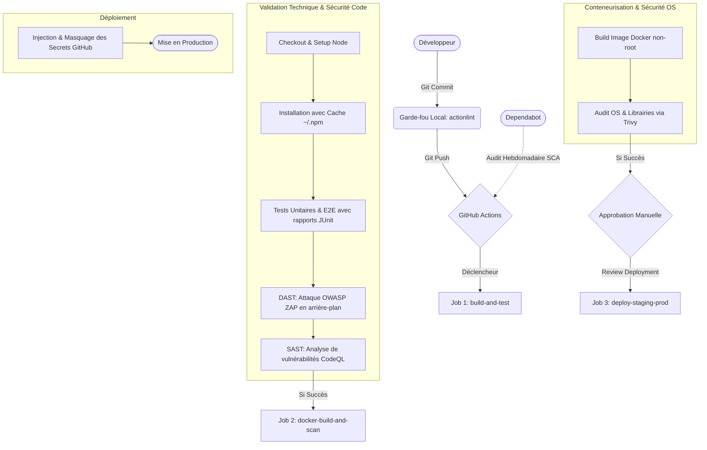

# Application Squelette

## Description
L'objectif de ce squelette est d'unifier les processus de build, de test et de validation de sécurité. Ce projet intègre volontairement des simulations de failles logiques et de configurations pour analyser le comportement des outils de détection continue et le masquage des flux de données dans la console.

## Architecture
L'arborescence respecte une structure standardisée pour dissocier le code source de l'application et sa suite de validation réglementaire:

* `public/` : Contient l'interface graphique utilisateur (Frontend HTML statique).
* `src/` : Regroupe la logique métier de l'API Express :
    * `app.js` : Configuration des routes d'API et intégration des cas d'étude de sécurité.
    * `server.js` : Point d'entrée opérationnel lançant le serveur web.
* `tests/` : Suite complète de tests automatisés s'exécutant en isolation:
    * `unit.test.js` : Validation d'une logique ou configuration interne isolée.
    * `integration.test.js` : Contrôle de la conformité des endpoints HTTP de l'API.
    * `e2e.test.js` : Simulation d'un parcours utilisateur de bout en bout.
* `.gitignore` : Fichier de configuration Git excluant les dépendances locales du suivi de version.
* `package.json` : Manifeste déclarant les métadonnées et packages tiers du projet.
* `package-lock.json` : Fichier de verrouillage des versions des modules tiers pour garantir la reproductibilité des environnements.

## Installation et utilisation
### 1. Prérequis
Assurez-vous de disposer de **Node.js** (version 22 ou supérieure) installé sur votre environnement de développement local.

### 2. Installation des dépendances
Pour installer proprement l'arborescence des modules tiers sans altérer le fichier de verrouillage, exécutez la commande suivante dans votre terminal:
```bash
npm ci
```

### 3. Exécution des tests
Avant de pousser vos modifications sur le dépôt distant, vous pouvez valider la robustesse globale de votre code en exécutant la suite de tests unitaires, d'intégration et end-to-end:
```bash
npm test
```

### 4. Démarrage de l'application
Pour lancer le serveur web localement et interagir avec l'interface graphique :
```bash
npm start
```

L'application sera accessible depuis votre navigateur à l'adresse suivante : `http://localhost:3000`.

## Validation continue (CI/CD)

Afin de garantir la validité de nos workflows GitHub Actions, un *pre-commit hook* exécute automatiquement l'outil `actionlint` avant chaque commit. 

**Exemple d'interception d'une erreur (ex: faute de frappe `run-on` au lieu de `runs-on`) :**

```text
Running actionlint to validate GitHub Actions workflows...
.github/workflows/ci.yml:7:3: "runs-on" section is missing in job "validate-code" [syntax-check]
  |
7 |   validate-code:
  |   ^~~~~~~~~~~~~~
.github/workflows/ci.yml:8:5: unexpected key "run-on" for "job" section. expected one of "concurrency", "container", "continue-on-error", "defaults", "env", "environment", "if", "name", "needs", "outputs", "permissions", "runs-on", "secrets", "services", "snapshot", "steps", "strategy", "timeout-minutes", "uses", "with" [syntax-check]
  |
8 |     run-on: ubuntu-latest
  |     ^~~~~~~
Error: actionlint found issues in your GitHub Actions workflows.
Commit rejected. Please fix the errors and try again.
```

Ce mécanisme de garde-fou bloque localement le commit et empêche l'envoi de configurations erronées sur le dépôt.

## Architecture DevSecOps (Pipeline GitHub Actions)

Le projet intègre une usine logicielle complète et hautement sécurisée, automatisant l'intégralité du cycle de vie du code jusqu'au déploiement. Le pipeline s'exécute à chaque `push`, de manière planifiée (`cron`), ou manuellement (`workflow_dispatch`).

### Workflow Visuel du Pipeline



### Couverture Complète du TP

Cette infrastructure couvre tous les piliers d'une chaîne DevSecOps moderne :

1. **Shift Left (Pre-commit)** : L'utilisation de `actionlint` empêche l'envoi de configurations de pipeline syntaxiquement incorrectes dès le poste du développeur.
2. **Intégration Continue (CI)** : Optimisation via le cache des dépendances Node.js et publication de tableaux de bords graphiques interactifs pour les résultats des tests Jest (JUnit).
3. **Software Composition Analysis (SCA)** : Veille automatisée via `dependabot.yml` pour mettre à jour les paquets vulnérables et auditer les actions GitHub tierces.
4. **Static Application Security Testing (SAST)** : Déploiement de GitHub CodeQL pour analyser de manière asynchrone le code source (détection des failles d'injection, XSS, fuites logiques).
5. **Dynamic Application Security Testing (DAST)** : Hacking en direct de l'API via le robot attaquant OWASP ZAP Baseline Scanner pendant le build.
6. **Container Security** : Création d'un conteneur optimisé sous Alpine, s'exécutant sans les droits `root`, et scanné de force par Trivy pour bloquer le déploiement en cas de failles OS critiques.
7. **Gouvernance et Secret Management** : Masquage total des variables sensibles dans la console, annulation intelligente des workflows obsolètes (Concurrency), limitation des temps d'exécution (Timeout), réduction des privilèges du GITHUB_TOKEN (Hardening) et déploiement bloqué par une validation humaine stricte (`Environment: production`).